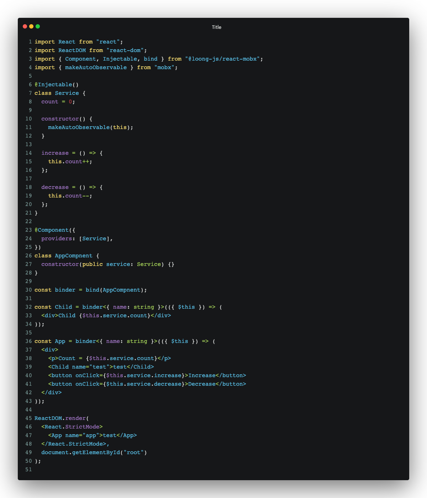

# @loong-js/react-mobx

通过依赖注入的方式搭建 `React` 应用。

## 安装

```bash
yarn add @loong-js/react-mobx

# 需要前置安装 react mobx mobx-react-lite
yarn add react mobx mobx-react-lite
```

## 环境配置

首先需要配置 `typescript` 输出元信息，如果使用 `Babel` 还需要额外配置。

### `typescript.json`

```json
{
  "compilerOptions": {
    "experimentalDecorators": true,
    // 输出编译信息
    "emitDecoratorMetadata": true
  }
}
```

### `Babel`

如果使用 `Babel` 编译 `ts`，需要添加 `babel-plugin-transform-typescript-metadata`，并且顺序如下（如果涉及装饰器的 `Babel` 插件还没装，也需要安装）。

```json
{
  "plugins": [
    "babel-plugin-transform-typescript-metadata",
    ["@babel/plugin-proposal-decorators", { "legacy": true }],
    ["@babel/plugin-proposal-class-properties", { "loose": true }]
  ]
}
```

## 使用

### 一个简单的例子（[代码地址](./demo/main.tsx)）

- `bind`，用来绑定使用 `Component` 注解的 UI 控制类；
- `Component`，注解一个 UI 控制类，接受 `{ providers: [...Services] }` 配置，`Services` 是服务类集合；
- `Injectable`，注解一个服务。



使用 `Component` 或者 `Injectable` 注解的类，可以通过在构造函数中声明来使用 `Component` 注解配置的服务类，服务类之间也可相互调用。

## API 参考

### `bind`

在组件上绑定使用 `Component` 注解的 UI 控制类，执行 `bind` 会返回 `binder` 函数。使用方法：

```typescript
import { Component, bind } from '@loong-js/react-mobx';

// 1. 注解一个 UI 控制类
@Component()
class AppCompnent {
  constructor() {}
}

// 2. 生成 binder 函数
const binder = bind(Component);

// 3. 使用 binder 绑定组件
const App = binder(() => <div>App</div>);

const App2 = binder(() => <div>App</div>);
```

#### `binder`

`binder` 函数接受两个参数，第一个函数组件，第二个 `options` 的接口定义是：

```typescript
interface IBinderOptions {
  // 使用 ref
  forwardRef?: boolean;
}
```

使用方式：

```typescript
// binder 接受两个泛型，第一个定义了 Props 的类型，第二个定义了 Ref 的类型
const App = binder<Record<string, unknown>, HTMLDivElement>(
  (props, ref) => <div ref={ref}>App</div>,
  {
    forwardRef: true,
  }
);
```

### 简单的例子

```typescript
import { FC } from 'react';
import { Component, BoundProps, bind } from '@loong-js/react-mobx';

@Component()
class AppCompnent {
  count = 0;

  constructor() {}
}

// 1. 直接使用
interface IAppProps {
  name?: string;
}

const App = bind(AppCompnent)<IAppProps>(({ $this }) => <div>Count: {$this.count}</div>);

// 2. 生成 binder
const binder = bind(AppComponent);

type PropsFromBinder = BoundProps<typeof binder>;

interface IApp2Props extends PropsFromBinder {
  name?: string;
}

const App2FC: FC<IApp2Props> = ({ $this }) => <div>{$this.count}</div>;

const App2 = binder(App2FC);
```

### `Component`

注解一个 UI 控制类，具体看 `bind` 的使用方式，`Component` 接受的 `options` 接口：

```typescript
// IClassType 指的是服务类或者 UI 控制类
interface IComponentOptions {
  providers: IClassType[];
}
```

### `Injectable`

注解一个服务，使用方式很简单：

```typescript
import { Injectable } from '@loong-js/react-mobx';

@Injectable()
class Service {}
```

### `Autowired`

在 UI 控制类或者服务上注入服务，使用方式：

```typescript
import { Component, bind, Autowired, Injectable } from '@loong-js/react-mobx';

@Injectable()
class Service1 {}

@Injectable()
class Service2 {
  // 在 Service2 中注入 Service1
  @Autowired()
  service1!: Service1;
}


@Component({
  providers: [
    Service1,
    Service2,
  ],
})
class AppCompnent {
  constructor(
    // 另一种注入服务的方式
    public service1: Service1,
  ) {}
}
const App = bind(AppCompnent)(({ $this }) => <div>App</div>);
```

#### `forwardRef`

有时候如果两个服务相互依赖，就会造成循环引用，以及在类实例化前声明的问题，这个时候可以通过 `forwardRef` 解决这个问题：

```typescript
import { forwardRef, Autowired, Injectable } from '@loong-js/react-mobx';

@Injectable()
class Service1 {
  @Autowired()
  service2 = forwardRef(() => Service2);
}

@Injectable()
class Service2 {
  // 在 Service2 中注入 Service1
  @Autowired()
  service1!: Service1;
}
```


### `Prop`

在 UI 控制类或者服务上绑定组件的 props，使用方式：

```typescript
import ReactDOM from 'react-dom';
import { Component, bind, Prop } from '@/index';

@Component()
class AppCompnent {
  // 默认使用属性名作为绑定的 prop 名称
  @Prop()
  name!: string;

  // 如果属性名与 prop 名称不一样，传入绑定的 prop 名称
  @Prop('name')
  nameAlias!: string;

  constructor() {
    console.log(this.name, this.nameAlias);
  }

  printName = () => {
    console.log(this.name);
  };
}
const App = bind(AppCompnent)<{ name: string }>(({ $this }) => (
  <div>
    <button onClick={$this.printName}>printName</button>
  </div>
));

ReactDOM.render(<App name="app" />, document.getElementById('root'));
```

### `Hook`

在 UI 控制类或者服务上绑定组件的钩子，使用方式：

```typescript
import { Component, bind, Hook } from '@/index';

@Component()
class AppCompnent {
  // 默认传入方法的名称作为钩子名
  @Hook()
  mounted() {
    console.log('mounted');
  }

  // 如果方法与 hook 名称不一样，传入绑定的 hook 名称
  @Hook('unmount')
  unmountAlias() {
    console.log('unmountAlias');
  }
}
const App = bind(AppCompnent)(({ $this }) => <div>App</div>);
```

### `Watch`

观察值的变化，第一次执行或者满足条件都会执行注解的方法，注解接受一个函数，函数类型是：

```typescript
// $this 是注解的类的实例，可以返回 boolean 或者依赖的属性数组
type Data = ($this: any) => boolean | any[];

export function Watch(data: Data): any;
// 接受依赖的属性字符串
export function Watch(...names: string[]): any;
export function Watch(...args: (Data | string)[]): any;
```

使用方式：

```typescript
@Component()
class AppCompnent {
  count = 0;

  count2 = 0;

  @Prop()
  name!: string;

  constructor() {
    makeAutoObservable(this);
  }

  increase = () => {
    this.count++;
  };

  increase2 = () => {
    this.count2++;
  };

  // 依赖的两个属性某个变化，就会触发方法
  @Watch('count', 'count2')
  change() {
    console.log('change >>>', this.count, this.count2);
  }

  // 依赖的三个属性某个变化，就会触发方法
  @Watch(({ count, count2, name }) => [count, count2, name])
  change2() {
    console.log('change2 >>>', this.count, this.count2, this.name);
  }

  // 满足条件才会触发方法
  @Watch(({ count }) => count >= 1)
  change3() {
    console.log('change3 >>>', this.count);
  }
}
```
## 本地开发
```bash
yarn dev
```

## 🐛 Issues

If you find a bug, please file an issue on [our issue tracker on GitHub](https://github.com/StructureBuilder/loong/issues).

## 🏁 Changelog

Changes are tracked in the [CHANGELOG.md](https://github.com/StructureBuilder/loong/blob/master/CHANGELOG.md).

## 📄 License

`@loong-js/react-mobx` is available under the [MIT](https://github.com/StructureBuilder/loong/blob/master/license) License.
